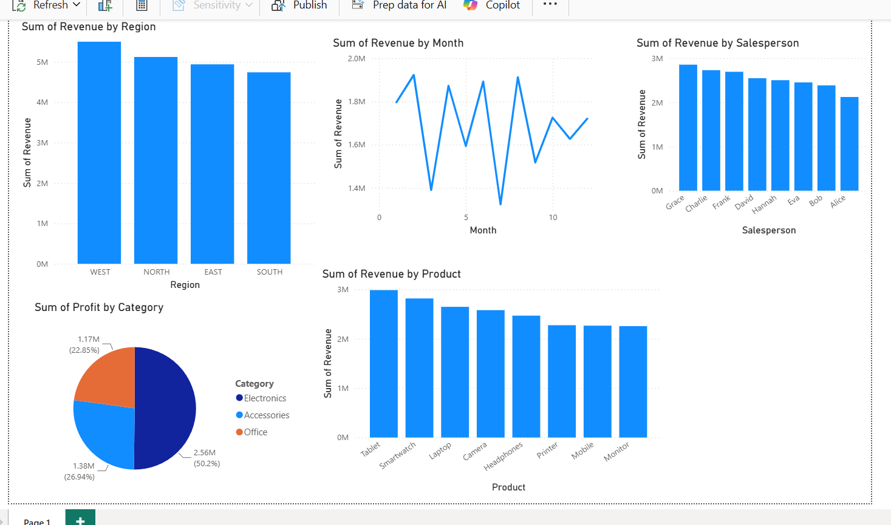

# sales-dashboard-analysis

## Problem Statement
Analyze sales data to identify top performing regions, products, and salespersons.

## Dataset
Sales Dataset 2024 — 1,886 rows after cleaning

## Tools Used
- Python (Pandas, Matplotlib, Seaborn)
- Power BI

## Key Insights
1. WEST region has highest revenue
2. Electronics category contributes 50.2% of total profit
3. Tablet is the best selling product
4. August has highest monthly sales
5. Grace is the top performing salesperson

## Dashboard Screenshot

